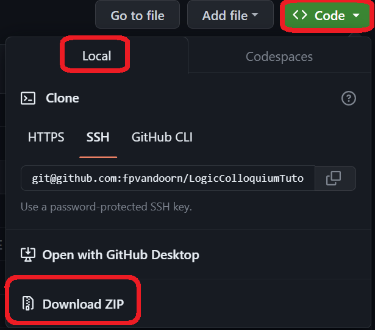
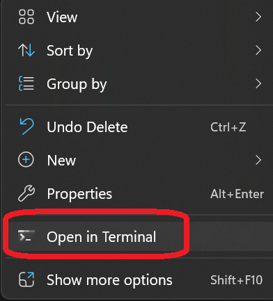

# Lean tutorial for Logic Colloquium 2023

In this tutorial you will be using Lean to prove theorems in a platform called Github Codespaces.
Lean will not actually be running on your computer, but you will connect to a machine where Lean is running remotely.

## Setting up Codespaces

* Create an account on Github by Pressing `Sign up` at the top-right of this screen (or sign in if you already have an account).
  * To sign up, you might want to right-click it and press `Open link in new tab` so that you can still read these instructions.
  * Signing up requires you to enter and verify an email address.
  * Afterwards, there are some questions that you can skip at the bottom of the page.
  * Go back to this page after you finished signing up.

* Once you are logged in, <a href='https://codespaces.new/fpvandoorn/LogicColloquiumTutorial' target="_blank" rel="noreferrer noopener">click this text (or the button below) to start your codespace</a> (open it in a new tab using right-click > `Open link in new tab`)

* Make sure the Machine type is `4-core`, and then press `Create codespace`

* Sit back for a few minutes. A remote machine is busily installing Lean.

* The following screen will automatically load. You can hide the bottom banner by pressing the `x` at the right of your screen. Open the explorer in the top right, press `LCTutorial` and `Introduction.lean` to start.

* Click anywhere in the text file. A second panel "Lean infoview" will appear on the right, and after a few seconds it will show "No info found." You will see vertical yellow bars meaning that Lean is starting up. Once they have disappeared it means that Lean is ready, and you are ready to start! This takes about a minute.

---
---
---
---
---
---
---
---
---
---
---
---

## Other ways of using Lean

If Github Codespaces is not working for some reason, here are some other ways to interact with Lean.

### Local installation

Installing Lean 4 on your own machine requires a few more steps, but is advised if you want to use Lean after this tutorial.

* Install VSCode and Lean 4 using [these instructions](https://leanprover.github.io/lean4/doc/quickstart.html).
* Download this project by clicking (the green button) `Code` > `Local` > `Download Zip`

* Open the folder `LogicColloquiumTutorial-master` that you just downloaded.
* Open a terminal in this folder. How to do this depends a bit on your operating system.
  On Windows you can do this by right-clicking an empty part of the folder, and clicking `Open in Terminal`.

* Run `lake exe cache get!` to download the Lean mathematical library.
* Run `code .` (including the dot!) to open Lean.
* Open the file `LCTutorial/Introduction.lean` to start (see instructions above).

### Using Gitpod

* Gitpod also requires an account on Github, and might also require a verification of your phone number.
  The steps to get started are a bit confusing if you don't have a Github account yet, since you will have to navigate through some pages twice (once before and once after verifying your phone number).

* Click this button to get started (you can open it in a new tab):

* Then log in using an account on Github, or create a new account if you don't have one yet.

* On the next page ("New Workspace"), press "Continue".

* Then you have to wait a minute for the remote server to download and install Lean.

* Open the file `LCTutorial/Introduction.lean` to start (see instructions above).

## Acknowledgements

This tutorial is based on [A glimpse of Lean](https://github.com/PatrickMassot/glimpse_of_lean) by Patrick Massot. If you have a lot more time, you should read the book [Mathematics in Lean](https://leanprover-community.github.io/mathematics_in_lean/).