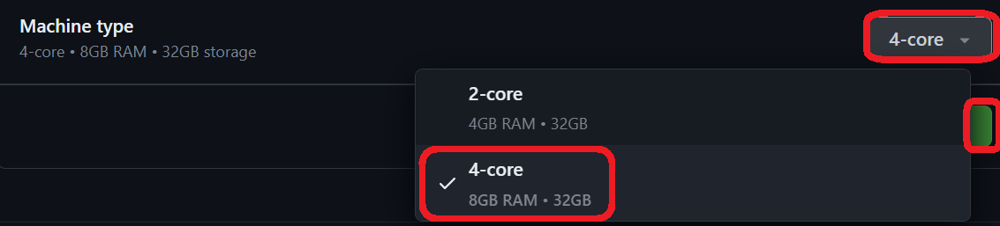
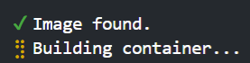
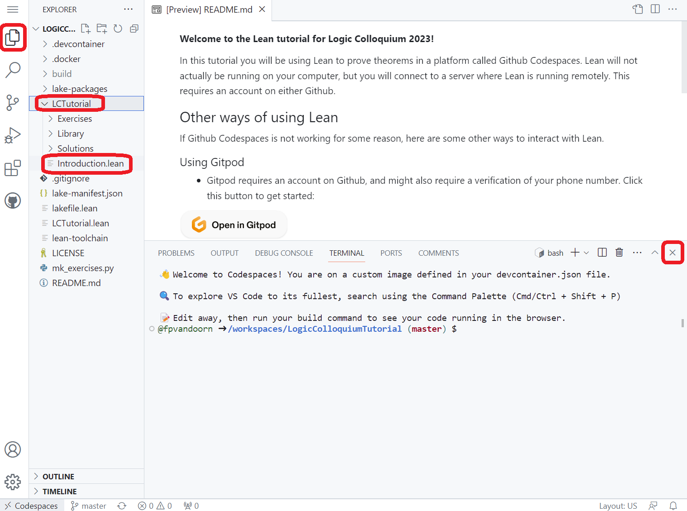
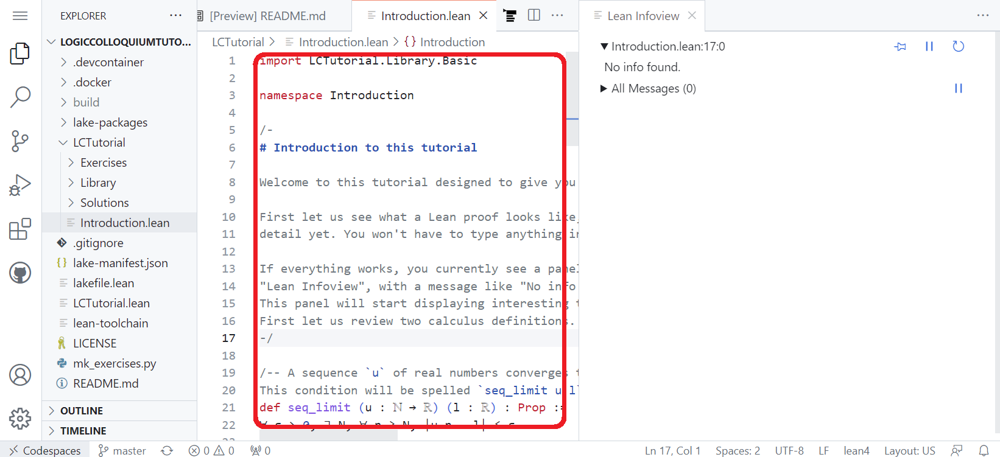

**Welcome to the Lean tutorial for Logic Colloquium 2023!**

In this tutorial you will be using Lean to prove theorems in a platform called Github Codespaces.
Lean will not actually be running on your computer, but you will connect to a server where Lean is running remotely.
This requires an account on Github.

## Setting up Codespaces

* Create an account on Github by Pressing `Sign up` at the top-right of this screen (or sign in if you already have an account).
  * To sign up, you might want to right-click it and press `Open link in new tab` so that you can still read these instructions.
  * Signing up requires you to enter and verify an email address.
  * Afterwards, there are some questions that you can skip at the bottom of the page.
  * Go back to this page after you finished signing up.

* If you are logged in, <a href='https://codespaces.new/fpvandoorn/LogicColloquiumTutorial' target="_blank" rel="noreferrer noopener">click this text (or the button below) to start your codespace</a>

* Make sure the Machine type is `4-core`, and then press `Create codespace`

* Sit back for a few minutes. A remote machine is busily installing Lean.

* The following screen will automatically load. You can hide the bottom banner by pressing the `x` at the right of your screen. Open the explorer in the top right, press `LCTutorial` and `Introduction.lean` to start.

* Click anywhere in the text file. A second panel "Lean infoview" will appear on the right, and after a few seconds it will show "No info found." This means that Lean is ready, and you are ready to start!

---
---
---
---
---
---
---
---
---
---
---
---

## Other ways of using Lean

If Github Codespaces is not working for some reason, here are some other ways to interact with Lean.

### Using Gitpod

* Gitpod requires an account on Github, and might also require a verification of your phone number.
  The steps to get started are a bit confusing if you don't have a Github account yet, since you will have to navigate through some pages twice (once before and once after verifying your phone number).

* Click this button to get started (you can open it in a new tab):

* Then login using an account on Github, or create a new account if you don't have one yet.

* On the next page ("New Workspace"), press "Continue".

* Then you have to wait a minute for the remote server to download and install Lean.

* Then open the file `LCTutorial/Introduction.lean`. You can do this from the file explorer, which is the left panel of the screen. If the file explorer isn't shown, you can reveal by clicking the second icon from the icon column on the left, showing two blank pages (just below the settings menu).

### Local installation

* Install Lean 4, download this project, run `lake exe cache get!`

<!-- After reading the `Introduction.lean` file, you should read explanations and do exercises in the
`Basics` folder, and then choose to work on one file from the `Topics` folder.
Of course you can play with all files from that folder if you have more time. -->

<!-- If you have a lot more time, you should read the book [Mathematics in Lean](https://leanprover-community.github.io/mathematics_in_lean/) (but note that book is currently using the stable version of Lean, Lean 3, whereas this repository uses the brand new Lean 4 which is not yet fully ready for mathematical use). -->

This tutorial is partly based on [A glimpse of Lean](https://github.com/PatrickMassot/glimpse_of_lean) by Patrick Massot.